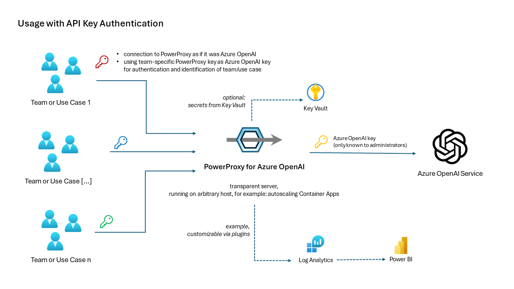
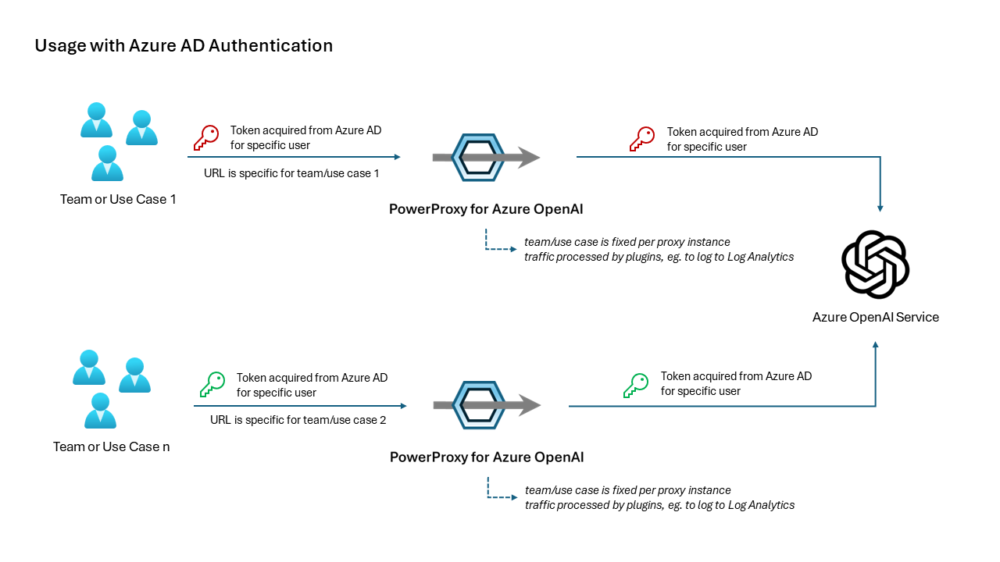
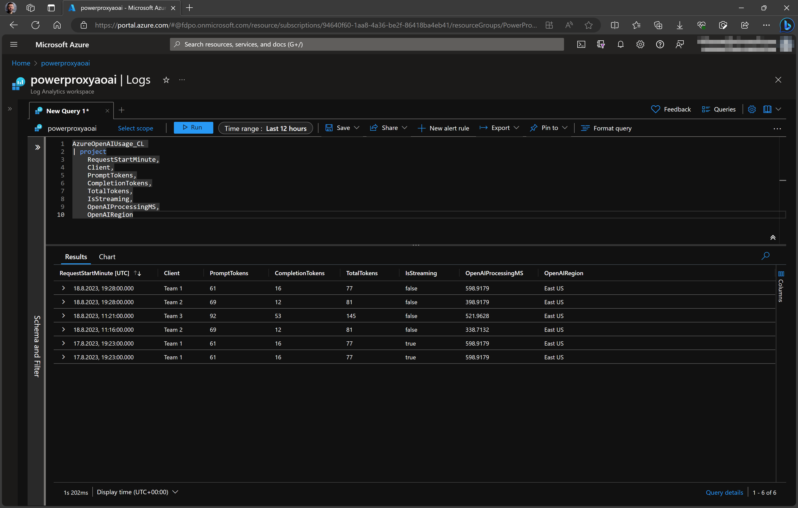
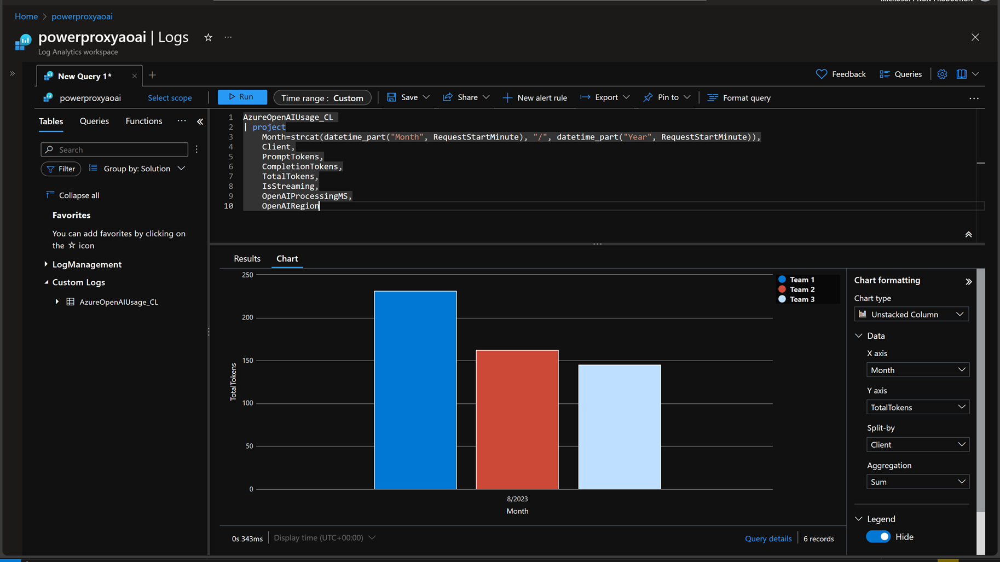
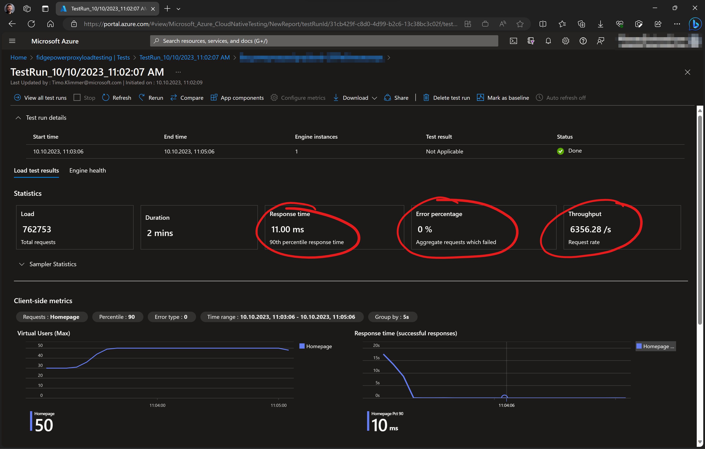
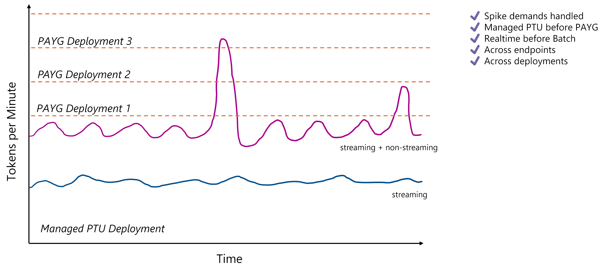

    <picture>
        <source media="(prefers-color-scheme: dark)" srcset="docs/logo-transparent-dark-mode.png"
            width="40%">
        
    </picture>

## Overview

PowerProxy for Azure OpenAI monitors and processes traffic to and from Azure OpenAI Service
endpoints.

As service "in the middle", it enables

- a smart load balancing, usually better suited for LLM scenarios than traditional round-robin

- to bill teams or use cases according to their consumption, esp. when shared deployments are used

- custom rate limiting, monitoring and content filtering

- validating and optimizing settings, eg. max_tokens

...and more.

Because it's transparent, it seamlessly works with frameworks like LangChain, Semantic Kernel, etc.
Besides, streaming responses are supported. Streaming responses are important for realtime/user
interaction scenarios.

It is a Python-based open source "solution accelerator" by Microsoft's AI GBB team and
friends. Provided "as is" = Free for use and modification. Not an official Microsoft product,
but supported as if it was developed by you.

There is also an article over at [Medium](https://medium.com/@timo.klimmer/powerproxy-for-azure-openai-e02b1c478bde)
introducing PowerProxy.

## Architecture

## Worth to Note

- Works on **any hosting service that runs Python and/or Docker**, for example Azure Container Apps
or Kubernetes.

- GitHub repo has **example deployment script for Azure Container Apps**.

- **Extremely fast** due to asynchronous processing and minimal set of Azure services being involved.
Low extra cost and latency. **Example: 6.300+ Requests per Second @ < 11ms in P90.**

- **Built for distributed** - scales out by running multiple workers and containers in parallel

- **Plugin architecture** and **open source**. Therefore, highly customizable. Python is a commonly
known programming language.

## Screenshots from Log Analytics

## Scalability

## Smart Load Balancing

## Installation and Usage
### Local Machine
1. Make sure you have a recent version of PowerShell installed (the repo was developed and tested
with PowerShell 7.3, see
[here](https://learn.microsoft.com/en-us/powershell/scripting/install/installing-powershell) for
installation manual)

2. Clone the repository, for example by running
`git clone https://github.com/timoklimmer/powerproxy-aoai.git`. Alternatively, you can use the code
from a specific release or tag to avoid versioning issues. If you have cloned the repo before, you
can switch to a specific version by running `git checkout tags\<tag>` after cloning.

3. Go to the contained `config` folder and copy the `config.example.yaml` file to a file named
`config.local.yaml`.

4. Edit the `config.local.yaml` file such that it contains the respective settings applying to your
environment. Note: Any file without `.example` in its name will intentionally be ignored by git to
avoid secrets being committed to the repo.

5. Make sure you have a Python environment with the packages from `requirements.txt` installed

6. Open the repo folder in VS.Code.

7. Activate the right Python environment.

8. Optionally set a breakpoint in `powerproxy.py` and

9. Launch the `Debug powerproxy.py` launch configuration.

To access your Azure OpenAI service via the proxy:
- Use `http://localhost` as the endpoint for your AOAI service instead of the real endpoint for
AOAI.
- For API key authentication: Use any of the passwords defined in the config file as AOAI key
instead of the real key shown in Azure AI Studio.
- For Azure AD authentication: Keep things as is. Do not send an API key but the bearer token from
Azure AD in the Authentication header.

### Azure
To deploy to Azure:
1. Deploy to your local machine.
2. Create a `config.azure.yaml` file similar to the `config.local.yaml` file you created before and
make sure it contains the right settings for your cloud environment.
3. Run the `Deploy-ToAzure.ps1` script in PowerShell, passing your `config.azure.yaml` config file
as `-ConfigFile` argument. For example: `.\Deploy-ToAzure.ps1 -ConfigFile config/config.azure.yaml`
Once the deployment script has successfully completed, your proxy should be up and running.

### Log Analytics
Log Analytics is now deployed by the contained deployment script. There is no need for taking extra
steps any more.

### Configuration updates
To update the configuration of an existing deployment, you can use the `Export-ConfigFromAzure.ps1`
and `Import-ConfigFromAzure.ps1` scripts. First, export the config to a local YAML file, then edit
the file, and afterwards import it into Azure again.

## Known Issues
- Due to limitations by OpenAI, the exact number of consumed tokens is not available when requests
ask for a streaming response. In that case, an approximation based on code provided by OpenAI is
used. Once exact numbers are available for streaming responses, this repo will be updated. For
non-streaming responses, token numbers are exact.

## Authors
- Timo Klimmer, Microsoft (lead)
- Clémense Lesné, Microsoft

## Contributing
If you want to contribute, feel free to send pull requests. After successful review, we will merge
your contribution into the main branch and add it to the next releases. However, before starting any
work, we strongly suggest to align with us first, so we can avoid duplicate work or misaligned
contributions. Also, we ask you to match the code style of the existing code. Any code provided to
us for inclusion to the repo, will automatically be given the same license of this repository.

## Disclaimer
This is NOT an official Microsoft product. Feel free to use the code on this repo but don't blame us
if things go wrong. If you bring this into production, make sure that your solution is not only
viable from a technical perspective but also from a commercial and legal perspective. It is highly
recommended to properly (load) test before going to production.

This presentation, demonstration, and demonstration model are for informational purposes only and
(1) are not subject to SOC 1 and SOC 2 compliance audits, and (2) are not designed, intended or made
available as a medical device(s) or as a substitute for professional medical advice, diagnosis,
treatment or judgment. Microsoft makes no warranties, express or implied, in this presentation,
demonstration, and demonstration model. Nothing in this presentation, demonstration, or
demonstration model modifies any of the terms and conditions of Microsoft’s written and signed
agreements. This is not an offer and applicable terms and the information provided are subject to
revision and may be changed at any time by Microsoft.

This presentation, demonstration, and demonstration model do not give you or your organization any
license to any patents, trademarks, copyrights, or other intellectual property covering the subject
matter in this presentation, demonstration, and demonstration model.

The information contained in this presentation, demonstration and demonstration model represents the
current view of Microsoft on the issues discussed as of the date of presentation and/or
demonstration, for the duration of your access to the demonstration model. Because Microsoft must
respond to changing market conditions, it should not be interpreted to be a commitment on the part
of Microsoft, and Microsoft cannot guarantee the accuracy of any information presented after the
date of presentation and/or demonstration and for the duration of your access to the demonstration
model.

No Microsoft technology, nor any of its component technologies, including the demonstration model,
is intended or made available as a substitute for the professional advice, opinion, or judgment of
(1) a certified financial services professional, or (2) a certified medical professional. Partners
or customers are responsible for ensuring the regulatory compliance of any solution they build using
Microsoft technologies.
